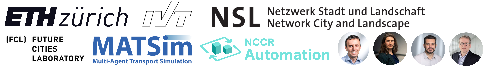

# Institute for Transport Planning and Systems (IVT)

Welcome to the GitHub repository of the institute for Transport Planning and Systems (IVT) at ETH Zürich.
Our institute is organized in **four research groups**, which synergistically tackle

- demand aspects (understand, simulate, forecast and assess in welfare terms the outcomes of future travel demand and future transport technologies and policies),
- supply for roads (model, simulate, optimize and control traffic flow in all kinds of vehicular networks), and
- public transport (analyse, model, predict and optimize the performance of a network, based on the limited available resources).

**What you will find here:**
In this repository you can find all repositories related to the publications of our institute.

# Presentation of Research Groups

## TMP – Transportation and Mobility Planning (Prof. Dr. Eva Heinen)
Our research focuses on understanding how the built and social environment can impact mobility and consequently health, emissions, and liveability. By gaining these insights, we can find solutions to design cities that improve the quality and sustainability of life.

The chair for Transportation and Mobility Planning focusses on following tasks:
- **Sustainable mobility**
- **Safe transportation**
- **Healthy transportation**
- **Inclusive mobility**

## TS - Transport Systems (Prof. Dr. Francesco Corman)

Society and economy require efficient, safe, financially viable and environmentally friendly mobility. Public transportation should provide a special contribution for that purpose.

The chair for Transport Systems focusses on following tasks:
- **Passenger transportation system evaluation and decision support**
- **System performance and stability**
- **Integration of rail freight transport systems in logistic chains**
- **Rail infrastructure management**

## SVT - Traffic Engineering (Dr. Kouvelas)

The SVT research group at the Institute for Transport Planning and Systems researches road transport systems and traffic operations, intelligent transportation systems (ITS) and connected and automated vehicles (CAVs).

The chair for Traffic Engineering focusses on following tasks:
- **Road transport systems**
- **Modeling and simulation**
- **Traffic operations**
- **Traffic flow theory**
- **Connected and automated vehicles** 
- **Intelligent transportation systems**
 
## VPL - Transport Planning (Prof. em. Dr. Kay W. Axhausen)

The chair for Transport Planning focusses on following tasks:
- **Travel Behaviour:** Elaboration of new knowldege and techniques in order to observe, measure, describe, model and assess spatial behaviour, especially travel behaviour.
- **Demand and network models:** Transfering travel behaviour to demand and network models through education and applied research, in order to economically assess behaviour modifications.
